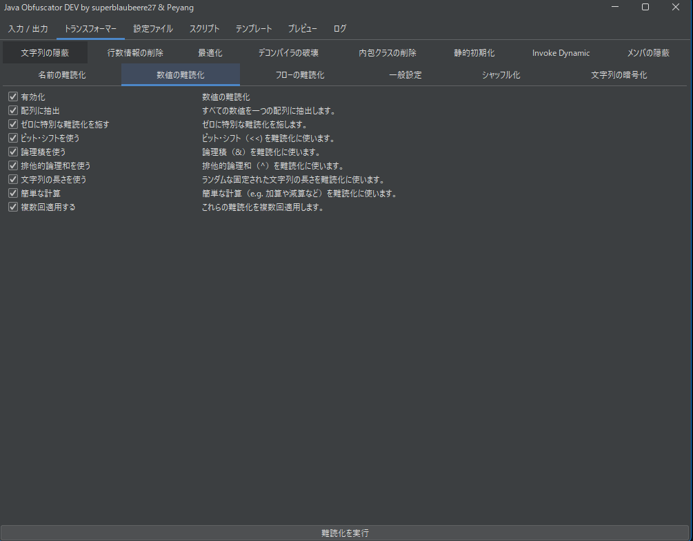

# Java Obfuscator（[superblaubeere27/obfuscator](https://github.com/superblaubeere27/obfuscator) 由来のフォーク）

(For English, see [README-en.md](README-en.md).)

**:white_check_mark: GUI完全対応 / 日本語＆英語表示対応**

このツールはJavaバイトコード向けの強力な難読化器で、次のような機能をサポートしています：

## 主な機能

- :white_check_mark: **フロー制御難読化（Flow Obfuscation）**  
  制御構造を改変してリバースエンジニアリングを困難にする
- :white_check_mark: **行番号の削除**  
  ソースコードの行番号情報を削除し、デバッグを妨害
- :white_check_mark: **数値難読化（ビット演算、文字列長利用など）**  
  数値を複雑な式や配列参照に変換し可読性を低下
- :white_check_mark: **名前の難読化（クラス名・メソッド名・フィールド名）＋カスタム辞書対応**  
  意味のある名前を無意味な記号に変換し解析を困難にする
- :white_check_mark: **Decompiler Crasher（動作安定化済み）**  
  一部のJava逆コンパイラをクラッシュさせる構文を安全に挿入
- :white_check_mark: **文字列暗号化（AES / XOR / Blowfish / DES に対応）**  
  ハードコードされた文字列をランタイムで復号化する方式に変更
- :white_check_mark: **インナークラス削除**  
  内部クラスを外部クラスとして展開・統合し構造を単純化
- :white_check_mark: **`invokedynamic` の活用**  
  メソッド呼び出しに `invokedynamic` を使用して可読性と追跡性を低下
- :white_check_mark: **参照プロキシ（全フィールドをリフレクション経由でアクセス）**  
  通常アクセスを避けてリフレクションでメンバーへアクセス
- :white_check_mark: **クラス・メソッド・フィールドの構造シャッフル＆隠蔽**  
  宣言順やアノテーションをランダム化し、見た目と構造を不安定化
- :white_check_mark: **プレビュー機能（設定結果をリアルタイムで確認可能）**  
  GUIから設定した内容を即座に反映・確認できる機能
- :white_check_mark: **GUI / ログの多言語化（現在は日本語・英語に対応）**  
  インターフェースと出力メッセージを多言語に対応
- :white_check_mark: **スクリプトによる除外設定**  
  特定のクラスやパッケージを難読化対象から除外するためのJavaScriptスクリプト機能
- :white_check_mark: **設定ファイル（JSON）による高度なカスタマイズ**  
  難読化の各種設定をJSON形式で柔軟に制御可能

---

## オリジナル版との差分

- :x: HWID制限を撤廃
- :white_check_mark: 数値難読化バグの修正（クラッシュなし）
- :white_check_mark: 全体的なコードの書き直しと改善
- :white_check_mark: 名前難読化設定の高機能化
- :white_check_mark: マッピングファイルの保存に対応
- :white_check_mark: 文字列暗号化アルゴリズムの追加
- :white_check_mark: ログ出力のカラーリング改善
- :white_check_mark: `MANIFEST.MF` 内の `Main-Class` 名のリネーム機能
- :white_check_mark: 文字列隠蔽時の, 文字列再利用による台帳の最適化（同じ文字列は1回だけ保持）

---

## スクリーンショット





---

## 使用方法

+ [Java 17](https://www.oracle.com/java/technologies/javase-jdk17-downloads.html) 以降が必要です。

```bash
java -jar obfuscator.jar --jarIn helloWorld.jar --jarOut helloWorld-obf.jar
java -jar obfuscator.jar --jarIn helloWorld.jar --jarOut helloWorld-obf.jar --config obfConfig.json
java -jar obfuscator.jar # GUI つき
```

---

## コマンドライン引数

- `--help`：ヘルプ表示
- `--version`：バージョン情報表示
- `--jarIn <入力JAR>`
- `--jarOut <出力JAR>`
- `--config <設定ファイル（JSON）>`
- `--cp <クラスパス>`
- `--scriptFile <スクリプトJSファイル>`
- `--threads <スレッド数>`
- `--verbose`：詳細ログを有効化

---

## 設定ファイル例（抜粋）

```json
{
  "string_encryption": {
    "enabled": true,
    "algorithm_aes": true,
    "algorithm_xor": true,
    "algorithm_blowfish": true,
    "algorithm_des": true
  },
  "line_number_remover": {
    "enabled": true,
    "rename_local_variables": true,
    "remove_line_numbers": true,
    "add_confusing_local_variables": true
  },
  "number_obfuscation": {
    "enabled": true,
    "extract_to_array": true,
    "obfuscate_zero": true,
    "shift": false,
    "and": true,
    "xor": true,
    "string_length": true,
    "simle_math": true,
    "multiple_instructions": true
  },
  "FlowObfuscator": {
    "enabled": true,
    "mangle_comparisons": true,
    "replace_goto": true,
    "replace_if": true,
    "bad_pop": true,
    "bad_concat": true,
    "mangle_switches": false,
    "mangle_return": false,
    "Mangle_local_variables": false
  },
  "inner_class_remover": {
    "enabled": true,
    "relocate_classes": false,
    "remove_metadata": true
  },
  "decompiler_crasher": {
    "enabled": true,
    "invalid_signatures": true,
    "empty_annotation_spam": true
  },
  "preview": {
    "enabled": true
  }
}
```

---

## 除外設定（特定クラスを難読化対象外にする）

JavaScriptスクリプトで制御する：

```js
function isRemappingEnabledForClass(node) {
    return !node.name.startsWith("org/json") && !node.name.startsWith("com/client/mixin");
}

function isObfuscatorEnabledForClass(node) {
    return !node.name.startsWith("org/json") && !node.name.startsWith("com/client/mixin");
}
```

さらに `name_obfuscation` セクションに除外指定を追記：

```
org.json.**
com.client.mixin.**
```

---

## 難読化結果（例）

元コード：

```java
import java.util.Random;
import java.util.Scanner;

public class Main {
    public static final int MAX_NUMBER = 100;

    public static void main(String[] args) {
        String helloWorld = "Hello, World!";

        while (true) {
            int randomNumber = new Random().nextInt(100) + 1;
            System.out.println("Random number is " + randomNumber);
            System.out.print("Enter a number between 1 and 100: ");
            String userInputString = getUserInput();
            int userInput = parseInt(userInputString);
            if (userInput >= 1 && userInput <= 100) {
                if (userInput == randomNumber) {
                    System.out.println("You guessed the number!");
                    System.out.println(helloWorld);
                    return;
                }

                System.out.println("Try again!");
            } else {
                System.out.println("Please enter a number between 1 and 100.");
            }
        }
    }

    public static String getUserInput() {
        Scanner scanner = new Scanner(System.in);
        System.out.print("Enter a string: ");
        return scanner.nextLine();
    }

    public static int parseInt(String input) {
        try {
            return Integer.parseInt(input);
        } catch (NumberFormatException var2) {
            System.out.println("Invalid input. Please enter a number.");
            return -1;
        }
    }
}

```

難読化後（詳細省略）：

```java

   public static void main(String[] var0) {
      int[] IlIllllllllllll = new int[ll[3]];
      double IIlllllllllllll = (double)stringsLedger[ll[1]];

      do {
         IlIllllllllllll[ll[1]] = I<"0">(new Random(), ll[45]) + ll[0];
         I<"5">(I<"1">(), I<"4">(I<"2">(stringsLedger[ll[0]]), I<"3">(IlIllllllllllll[ll[1]])));
         I<"6">(I<"1">(), stringsLedger[ll[3]]);
         int llIllllllllllll = I<"7">();
         IlIllllllllllll[ll[0]] = I<"8">(llIllllllllllll);
         if (compareOf161(IlIllllllllllll[ll[0]], ll[0]) && compareOf163(IlIllllllllllll[ll[0]], ll[45])) {
            if (compareOf160(IlIllllllllllll[ll[0]], IlIllllllllllll[ll[1]])) {
               I<"5">(I<"1">(), stringsLedger[ll[5]]);
               I<"5">(I<"1">(), IIlllllllllllll);
               Il[ll[1]].length();
               if (Il[ll[7]].length() <= -(ll[3] + ll[4] - ll[46] + ll[2] + ll[4] + ll[12] + ll[3] + ll[12] + ll[7] + ll[11] + ll[11] + ll[12])) {
                  return;
               }

               return;
            }

            I<"5">(I<"1">(), stringsLedger[ll[4]]);
            Il[ll[1]].length();
            if (ll[0] << ll[0] > ll[0] << ll[0]) {
               return;
            }
         } else {
            I<"5">(I<"1">(), stringsLedger[ll[8]]);
         }

         Il[ll[1]].length();
      } while (-Il[ll[5]].length() <= 0);
   }
```

<details>

<summary>難読化後の**完全な**コードを表示</summary>

```java
import java.io.InputStream;
import java.io.PrintStream;
import java.lang.invoke.CallSite;
import java.lang.invoke.ConstantCallSite;
import java.lang.invoke.MethodHandle;
import java.lang.invoke.MethodType;
import java.lang.invoke.MethodHandles.Lookup;
import java.nio.charset.StandardCharsets;
import java.security.MessageDigest;
import java.util.Arrays;
import java.util.Base64;
import java.util.Random;
import java.util.Scanner;
import javax.crypto.Cipher;
import javax.crypto.spec.SecretKeySpec;

public class Main {
   private static String[] Il;
   private static final int[] ll;

   private static boolean compareOf162(int lIlIIIIllllllll, int IIlIIIIllllllll) {
      return (boolean)(lIlIIIIllllllll < IIlIIIIllllllll ? ll[0] : ll[1]);
   }

   public static String getUserInput() {
      Scanner lllIlllllllllll = new Scanner(I<"9">());
      I<"6">(I<"1">(), stringsLedger[ll[2]]);
      String IllIlllllllllll = I<"10">(lllIlllllllllll);
      Il[ll[1]].length();
      return ll[0] << ll[3] == 0 ? null : IllIlllllllllll;
   }

   private static boolean compareOf160(int lIllIIIllllllll, int IIllIIIllllllll) {
      return (boolean)(lIllIIIllllllll == IIllIIIllllllll ? ll[0] : ll[1]);
   }

   private static String decryptXOR(String IIIlIIlllllllll, String IlIIIIlllllllll) {
      float IlllllIllllllll = (float)(new int[ll[4]]);
      Exception lIllllIllllllll = new String(Base64.getDecoder().decode(llIIIIlllllllll.getBytes(StandardCharsets.UTF_8)), StandardCharsets.UTF_8);
      StringBuilder IllIIIlllllllll = new StringBuilder();
      char[] lIlIIIlllllllll = lllIIIlllllllll.toCharArray();
      ((Object[])lIllllIllllllll)[ll[1]] = ll[1];
      long llllllIllllllll = lIllllIllllllll.toCharArray();
      ((Object[])lIllllIllllllll)[ll[0]] = llllllIllllllll.length;
      ((Object[])lIllllIllllllll)[ll[3]] = ll[1];

      while (compareOf162((int)((Object[])lIllllIllllllll)[ll[3]], (int)((Object[])lIllllIllllllll)[ll[0]])) {
         ((Object[])lIllllIllllllll)[ll[5]] = llllllIllllllll[((Object[])lIllllIllllllll)[ll[3]]];
         IllIIIlllllllll.append((char)(((Object[])lIllllIllllllll)[ll[5]] ^ lIlIIIlllllllll[((Object[])lIllllIllllllll)[ll[1]] % lIlIIIlllllllll.length]));
         Il[ll[1]].length();
         ((Object[])lIllllIllllllll)[ll[1]] = ((Object[])lIllllIllllllll)[ll[1]] + ll[0];
         ((Object[])lIllllIllllllll)[ll[3]] = ((Object[])lIllllIllllllll)[ll[3]] + ll[0];
         Il[ll[1]].length();
         if (Il[ll[0]].length()
               + (ll[6] ^ ll[6])
               + Il[ll[3]].length()
               + (ll[0] << ll[3])
               - (ll[7] + ll[0] + ll[1] + ll[5] + ll[2] + ll[7] + ll[7] + ll[5] - ll[5])
               + (ll[2] + ll[8] + ll[5] + ll[0] + ll[2] + ll[7] - ll[9])
               + Il[ll[5]].length()
               + (ll[10] ^ ll[10])
               + Il[ll[4]].length()
               + Il[ll[8]].length()
               + (ll[11] + ll[12] + ll[5] + ll[5] + ll[11] + ll[8] + ll[7] + ll[1] + ll[0] + ll[7] + ll[3] + ll[5] - ll[13])
               + (ll[12] + ll[11] + ll[3] - ll[14])
            < 0) {
            return null;
         }
      }

      lIllllIllllllll = String.valueOf(IllIIIlllllllll);
      Il[ll[1]].length();
      return ll[7] + ll[0] + ll[4] + ll[4] + ll[0] + ll[7] + ll[5] - ll[15] < 0 ? null : lIllllIllllllll;
   }

   private static String decryptDES(String IlIIllIllllllll, String llIIllIllllllll) {
      String var10000;
      try {
         SecretKeySpec lllIllIllllllll = new SecretKeySpec(
            Arrays.copyOf(MessageDigest.getInstance(Il[ll[2]]).digest(lIIIllIllllllll.getBytes(StandardCharsets.UTF_8)), ll[12]), Il[ll[11]]
         );
         Cipher IllIllIllllllll = Cipher.getInstance(Il[ll[11]]);
         IllIllIllllllll.init(ll[3], lllIllIllllllll);
         var10000 = new String(IllIllIllllllll.doFinal(Base64.getDecoder().decode(IIlIllIllllllll.getBytes(StandardCharsets.UTF_8))), StandardCharsets.UTF_8);
      } catch (Exception IlllIlIllllllll) {
         IlllIlIllllllll.printStackTrace();
         float var5 = null;
         Il[ll[1]].length();
         if (ll[8] + ll[1] + ll[8] + ll[12] + ll[8] + ll[11] - ll[32] != 0) {
            return (String)var5;
         }

         return null;
      }

      float var6 = var10000;
      Il[ll[1]].length();
      return (Il[ll[12]].length() ^ Il[ll[12]].length())
            != ll[2]
               + ll[11]
               + ll[12]
               - ll[16]
               + ll[7]
               + ll[7]
               + (ll[1] + ll[4] + ll[0] + ll[3] + ll[8] + ll[1] + ll[5] - ll[12])
               + (ll[17] ^ ll[18])
               + (ll[19] & (ll[19] ^ ll[20]))
               + (ll[21] ^ ll[22])
               + (ll[23] ^ ll[24])
               + (ll[25] ^ ll[26])
               + (ll[1] + ll[3] + ll[5] + ll[4] + ll[7] + ll[7] - ll[27])
               + (ll[28] ^ ll[29])
               + Il[ll[0]].length()
               - (ll[30] ^ ll[31])
         ? null
         : var6;
   }

   private static void l() {
      I = new String[ll[33]];
      I[ll[34]] = stringsLedger[ll[7]];
      I[ll[4]] = stringsLedger[ll[35]];
      I[ll[11]] = stringsLedger[ll[34]];
      I[ll[3]] = stringsLedger[ll[33]];
      I[ll[1]] = stringsLedger[ll[36]];
      I[ll[35]] = stringsLedger[ll[37]];
      I[ll[2]] = stringsLedger[ll[38]];
      I[ll[5]] = stringsLedger[ll[39]];
      I[ll[8]] = stringsLedger[ll[14]];
      I[ll[0]] = stringsLedger[ll[40]];
      I[ll[7]] = stringsLedger[ll[41]];
      I[ll[12]] = stringsLedger[ll[42]];
      l = new Class[ll[5]];
      l[ll[3]] = int.class;
      l[ll[1]] = PrintStream.class;
      l[ll[0]] = InputStream.class;
      Il[ll[1]].length();
      if (-(
            ll[4]
               + ll[3]
               + ll[4]
               + ll[1]
               + ll[2]
               + ll[1]
               + ll[7]
               - ll[14]
               + (ll[5] + ll[12] + ll[12] + ll[4] + ll[11] + ll[4] + ll[2] + ll[7] + ll[0] + ll[11] - ll[43])
               + (ll[29] ^ ll[44])
               + ll[4]
               + ll[0]
               + ll[3]
               - (ll[8] + ll[3] + ll[4] + ll[11] + ll[3] + ll[8] - ll[8])
         )
         <= 0) {
         ;
      }
   }

   public static void main(String[] var0) {
      int[] IlIllllllllllll = new int[ll[3]];
      double IIlllllllllllll = (double)stringsLedger[ll[1]];

      do {
         IlIllllllllllll[ll[1]] = I<"0">(new Random(), ll[45]) + ll[0];
         I<"5">(I<"1">(), I<"4">(I<"2">(stringsLedger[ll[0]]), I<"3">(IlIllllllllllll[ll[1]])));
         I<"6">(I<"1">(), stringsLedger[ll[3]]);
         int llIllllllllllll = I<"7">();
         IlIllllllllllll[ll[0]] = I<"8">(llIllllllllllll);
         if (compareOf161(IlIllllllllllll[ll[0]], ll[0]) && compareOf163(IlIllllllllllll[ll[0]], ll[45])) {
            if (compareOf160(IlIllllllllllll[ll[0]], IlIllllllllllll[ll[1]])) {
               I<"5">(I<"1">(), stringsLedger[ll[5]]);
               I<"5">(I<"1">(), IIlllllllllllll);
               Il[ll[1]].length();
               if (Il[ll[7]].length() <= -(ll[3] + ll[4] - ll[46] + ll[2] + ll[4] + ll[12] + ll[3] + ll[12] + ll[7] + ll[11] + ll[11] + ll[12])) {
                  return;
               }

               return;
            }

            I<"5">(I<"1">(), stringsLedger[ll[4]]);
            Il[ll[1]].length();
            if (ll[0] << ll[0] > ll[0] << ll[0]) {
               return;
            }
         } else {
            I<"5">(I<"1">(), stringsLedger[ll[8]]);
         }

         Il[ll[1]].length();
      } while (-Il[ll[5]].length() <= 0);
   }

   private static CallSite I(Lookup IIlllIlllllllll, String IIIllIlllllllll, MethodType IlIllIlllllllll) throws IllegalAccessException, NoSuchMethodException {
      IlIIlIlllllllll = new int[ll[0]];

      ConstantCallSite var10000;
      try {
         String[] IlIIIllllllllll = I[Integer.parseInt(llIllIlllllllll)].split(stringsLedger[ll[12]]);
         Class<?> lIIIIllllllllll = Class.forName(IlIIIllllllllll[ll[1]]);
         String IIIIIllllllllll = IlIIIllllllllll[ll[0]];
         MethodHandle lllllIlllllllll = null;
         ((Object[])IlIIlIlllllllll)[ll[1]] = IlIIIllllllllll[ll[5]].length();
         MethodHandle lIIIlIlllllllll;
         if (compareOf163((int)((Object[])IlIIlIlllllllll)[ll[1]], ll[3])) {
            MethodType IIlIIllllllllll = MethodType.fromMethodDescriptorString(IlIIIllllllllll[ll[3]], Main.class.getClassLoader());
            if (compareOf160((int)((Object[])IlIIlIlllllllll)[ll[1]], ll[3])) {
               lIIIlIlllllllll = lIIllIlllllllll.findVirtual(lIIIIllllllllll, IIIIIllllllllll, IIlIIllllllllll);
               Il[ll[1]].length();
               if ((ll[47] ^ ll[48]) <= ll[2] + ll[12] + ll[7] + ll[11] - ll[49] + ll[1] + ll[3] + ll[2] + ll[3]) {
                  return null;
               }
            } else {
               lIIIlIlllllllll = lIIllIlllllllll.findStatic(lIIIIllllllllll, IIIIIllllllllll, IIlIIllllllllll);
            }

            Il[ll[1]].length();
            if ((ll[50] & (ll[50] ^ ll[20])) > (ll[15] ^ ll[51])) {
               return null;
            }
         } else {
            Class llIIIllllllllll = l[Integer.parseInt(IlIIIllllllllll[ll[3]])];
            if (compareOf160((int)((Object[])IlIIlIlllllllll)[ll[1]], ll[5])) {
               lIIIlIlllllllll = lIIllIlllllllll.findGetter(lIIIIllllllllll, IIIIIllllllllll, llIIIllllllllll);
               Il[ll[1]].length();
               if ((ll[44] ^ ll[52] ^ ll[53] ^ ll[54])
                  <= (
                     ll[2] + ll[12] + ll[7] + ll[7] + ll[11] + ll[12] + ll[8] + ll[5] - ll[12]
                        ^ ll[0] + ll[7] + ll[0] + ll[7] + ll[7] + ll[1] + ll[0] + ll[4] - ll[55]
                  )) {
                  return null;
               }
            } else if (compareOf160((int)((Object[])IlIIlIlllllllll)[ll[1]], ll[4])) {
               lIIIlIlllllllll = lIIllIlllllllll.findStaticGetter(lIIIIllllllllll, IIIIIllllllllll, llIIIllllllllll);
               Il[ll[1]].length();
               if ((ll[56] ^ ll[57])
                     + Il[ll[3]].length()
                     + (ll[0] << ll[3])
                     - Il[ll[35]].length()
                     + (ll[58] ^ ll[59])
                     + (ll[8] + ll[0] + ll[2] + ll[12] + ll[4] + ll[1] + ll[0] + ll[12] + ll[8] + ll[3] + ll[1] - ll[60])
                  != 0) {
                  return null;
               }
            } else if (compareOf160((int)((Object[])IlIIlIlllllllll)[ll[1]], ll[8])) {
               lIIIlIlllllllll = lIIllIlllllllll.findSetter(lIIIIllllllllll, IIIIIllllllllll, llIIIllllllllll);
               Il[ll[1]].length();
               if ((ll[45] ^ ll[61]) == 0) {
                  return null;
               }
            } else {
               lIIIlIlllllllll = lIIllIlllllllll.findStaticSetter(lIIIIllllllllll, IIIIIllllllllll, llIIIllllllllll);
            }
         }

         var10000 = new ConstantCallSite(lIIIlIlllllllll);
      } catch (Exception IlIIlIlllllllll) {
         IlIIlIlllllllll.printStackTrace();
         byte lIIIlIlllllllll = null;
         Il[ll[1]].length();
         if (Il[ll[7]].length()
            <= (ll[1] + ll[7] + ll[8] + ll[11] + ll[12] + ll[3] + ll[2] + ll[7] - ll[7] + ll[12] + ll[3] + ll[12] + ll[1] ^ Il[ll[34]].length())) {
            return (CallSite)lIIIlIlllllllll;
         }

         return null;
      }

      byte lIIIlIlllllllll = var10000;
      Il[ll[1]].length();
      return Il[ll[5]].length() < 0 ? null : lIIIlIlllllllll;
   }

   public Main() {
      Il[ll[1]].length();
      if (ll[0] << ll[0] < 0) {
         throw null;
      }
   }

   private static String decryptBlowfish(String IIlIlIIllllllll, String lIlIlIIllllllll) {
      String var10000;
      try {
         SecretKeySpec lIIllIIllllllll = new SecretKeySpec(
            MessageDigest.getInstance(Il[ll[2]]).digest(llIIlIIllllllll.getBytes(StandardCharsets.UTF_8)), Il[ll[33]]
         );
         Cipher IIIllIIllllllll = Cipher.getInstance(Il[ll[33]]);
         IIIllIIllllllll.init(ll[3], lIIllIIllllllll);
         var10000 = new String(IIIllIIllllllll.doFinal(Base64.getDecoder().decode(IllIlIIllllllll.getBytes(StandardCharsets.UTF_8))), StandardCharsets.UTF_8);
      } catch (Exception IIIIlIIllllllll) {
         IIIIlIIllllllll.printStackTrace();
         double var5 = null;
         Il[ll[1]].length();
         if (null == null) {
            return (String)var5;
         }

         return null;
      }

      double var6 = var10000;
      Il[ll[1]].length();
      return Il[ll[0]].length()
               + (ll[12] + ll[7] + ll[4] + ll[7] + ll[11] + ll[1] + ll[7] + ll[0] + ll[7] + ll[8] + ll[2] - ll[62])
               + (ll[8] ^ ll[1])
               + (ll[63] ^ ll[64])
               + (ll[5] << ll[0])
               + Il[ll[0]].length()
               + Il[ll[36]].length()
               + (ll[65] ^ ll[54])
               + ll[7]
               + ll[1]
               - ll[37]
               + ll[3]
               + ll[11]
               + ll[0]
               + ll[1]
               + (ll[9] ^ ll[66])
               + ll[8]
               + ll[11]
               + ll[4]
               + ll[7]
               + ll[3]
               - ll[51]
               + ll[12]
               + (ll[67] ^ ll[68])
               - (ll[11] << ll[5])
            == 0
         ? null
         : var6;
   }

   private static void buildLedger() {
      stringsLedger = new String[ll[69]];
      stringsLedger[ll[1]] = decryptBlowfish(Il[ll[37]], Il[ll[38]]);
      stringsLedger[ll[0]] = decryptAES(Il[ll[39]], Il[ll[14]]);
      stringsLedger[ll[3]] = decryptAES(Il[ll[40]], Il[ll[41]]);
      stringsLedger[ll[5]] = decryptDES(Il[ll[42]], Il[ll[69]]);
      stringsLedger[ll[4]] = decryptAES(Il[ll[9]], Il[ll[66]]);
      stringsLedger[ll[8]] = decryptAES(Il[ll[70]], Il[ll[71]]);
      stringsLedger[ll[2]] = decryptDES(Il[ll[27]], Il[ll[72]]);
      stringsLedger[ll[11]] = decryptDES(Il[ll[73]], Il[ll[32]]);
      stringsLedger[ll[12]] = decryptBlowfish(Il[ll[15]], Il[ll[51]]);
      stringsLedger[ll[7]] = decryptAES(Il[ll[21]], Il[ll[74]]);
      stringsLedger[ll[35]] = decryptXOR(Il[ll[16]], Il[ll[22]]);
      stringsLedger[ll[34]] = decryptXOR(Il[ll[75]], Il[ll[60]]);
      stringsLedger[ll[33]] = decryptDES(Il[ll[76]], Il[ll[49]]);
      stringsLedger[ll[36]] = decryptBlowfish(Il[ll[77]], Il[ll[78]]);
      stringsLedger[ll[37]] = decryptDES(Il[ll[6]], Il[ll[79]]);
      stringsLedger[ll[38]] = decryptBlowfish(Il[ll[80]], Il[ll[81]]);
      stringsLedger[ll[39]] = decryptAES(Il[ll[82]], Il[ll[83]]);
      stringsLedger[ll[14]] = decryptAES(Il[ll[84]], Il[ll[25]]);
      stringsLedger[ll[40]] = decryptXOR(Il[ll[85]], Il[ll[86]]);
      stringsLedger[ll[41]] = decryptXOR(Il[ll[43]], Il[ll[13]]);
      stringsLedger[ll[42]] = decryptDES(Il[ll[87]], Il[ll[53]]);
      Il[ll[1]].length();
      if (null == null) {
         ;
      }
   }

   private static boolean compareOf161(int lIIlIIIllllllll, int IIIlIIIllllllll) {
      return (boolean)(lIIlIIIllllllll >= IIIlIIIllllllll ? ll[0] : ll[1]);
   }

   public static int parseInt(String IlIIlllllllllll) {
      int var3;
      try {
         var3 = I<"11">(IlIIlllllllllll);
         Il[ll[1]].length();
         if ((ll[12] + ll[5] + ll[7] + ll[0] + ll[11] + ll[3] + ll[5] + ll[11] + ll[1] - ll[88] + ll[5] + ll[7] + ll[8] ^ ll[89] ^ ll[0]) == 0) {
            return Il[ll[1]].length();
         }
      } catch (NumberFormatException IIIIlllllllllll) {
         I<"5">(I<"1">(), stringsLedger[ll[11]]);
         var3 = ll[20];
         Il[ll[1]].length();
         if ((ll[90] ^ ll[91]) == 0) {
            return Il[ll[1]].length();
         }
      }

      return var3;
   }

   static {
      Il();
      retrieveStrings();
      buildLedger();
      l();
      Il[ll[1]].length();
      if (Il[ll[0]].length() > 0) {
         ;
      }
   }

   private static String decryptAES(String llIIIlIllllllll, String IIlIIlIllllllll) {
      String var10000;
      try {
         SecretKeySpec IIIlIlIllllllll = new SecretKeySpec(
            MessageDigest.getInstance(Il[ll[56]]).digest(IlIIIlIllllllll.getBytes(StandardCharsets.UTF_8)), Il[ll[26]]
         );
         Cipher lllIIlIllllllll = Cipher.getInstance(Il[ll[26]]);
         lllIIlIllllllll.init(ll[3], IIIlIlIllllllll);
         var10000 = new String(lllIIlIllllllll.doFinal(Base64.getDecoder().decode(lIlIIlIllllllll.getBytes(StandardCharsets.UTF_8))), StandardCharsets.UTF_8);
      } catch (Exception lllllIIllllllll) {
         lllllIIllllllll.printStackTrace();
         double var5 = null;
         Il[ll[1]].length();
         if (null == null) {
            return (String)var5;
         }

         return null;
      }

      double var6 = var10000;
      Il[ll[1]].length();
      return Il[ll[5]].length() == Il[ll[4]].length() ? null : var6;
   }

   private static boolean compareOf163(int lIIIIIIllllllll, int IIIIIIIllllllll) {
      return (boolean)(lIIIIIIllllllll <= IIIIIIIllllllll ? ll[0] : ll[1]);
   }

   private static void retrieveStrings() {
      String var0 = new Exception().getStackTrace()[ll[1]].getFileName();
      Il = var0.substring(var0.indexOf("㫧") + ll[0], var0.lastIndexOf("茵")).split("\uea45");
   }

   private static void Il() {
      ll = new int[92];
      ll[0] = 67 ^ 26 ^ "                                                                                        ".length();
      ll[1] = "                                                                                                                                         "
            .length()
         ^ 0 + 7 + 3 + 0 - -82 + 5 + 7 + 8 + 2 + 9 + 5 + 9;
      ll[2] = "                                                                                                                                                                   "
            .length()
         ^ 2 + 7 + 3 - -153;
      ll[3] = "  ".length();
      ll[4] = "    ".length();
      ll[5] = "  ".length()
         + (28 & ~28)
         + "    ".length()
         + "   ".length()
         + (81 ^ 80)
         + (147 ^ 149)
         + "        ".length()
         + (154 ^ 153)
         + "     ".length()
         + (124 ^ 127)
         - (4 + 9 + 7 + 8 + 0 + 4 + 7 - -1)
         + (1 << 3);
      ll[6] = 21 << 1;
      ll[7] = "         ".length();
      ll[8] = "     ".length();
      ll[9] = 86 ^ 64;
      ll[10] = "                                                                              ".length();
      ll[11] = "      ".length() + (177 ^ 180) + (129 ^ 131) + 8 + 9 + 9 - 42 + 7 + 6 + 7 + (3 + 7 + 0 + 7 - 11) - "                ".length();
      ll[12] = 1 + 7 + 5 + 3 + 3 + 1 + 4 + 2 + 3 + 9 + 5 + 6 - 41;
      ll[13] = "                                                     ".length();
      ll[14] = "                 ".length();
      ll[15] = 4 ^ 26;
      ll[16] = 0 + 7 + 7 - 46 + 6 + 9 + 8 + 8 + 6 + 0 + (86 ^ 81) - -(7 + 7 + 0 + 0) + (60 ^ 56) + 1 + 3 - 51 + 6 + 8 + 8 + 8 + 9 + 1 + 9 + 2;
      ll[17] = 0 + 9 + 8 - -132;
      ll[18] = 9
         + 2
         + 6
         + 7
         + 9
         + 9
         + 4
         + 6
         + 7
         + 4
         - 66
         + 1
         + 4
         + (82 ^ 87)
         + 7
         + 6
         + 3
         - 15
         + 4
         - -"                                                                                                             ".length()
         + (30 ^ 31)
         + (96 & ~96)
         + (8 + 7 + 9 + 6 + 4 + 8 + 9 - 42)
         + (1 << 3)
         + (129 ^ 134);
      ll[19] = 6 + 3 + 3 + 9 + 4 + 3 - -56;
      ll[20] = -(
         "                                                                                                                                                                "
               .length()
            ^ 7 + 7 + 9 + 7 + 5 + 9 + 9 + 9 + 6 + 4 + 2 - -87
      );
      ll[21] = 8
         + 6
         + 4
         - 53
         + 3
         + 1
         + 9
         + 7
         + 5
         + 4
         + 0
         + 7
         + 6
         + 3
         + 8
         - 35
         + 5
         + 3
         + 4
         + 7
         + 4
         + 0
         + 4
         + (2 ^ 5)
         + "       ".length()
         + 1
         + 5
         + 6
         - 31
         + 5
         + 9
         + 4
         + 0
         + 1
         + (4 + 1 + 7 + 2 + 3 + 9 + 2 + 2 + 0 - 30)
         + (49 ^ 53)
         + (93 ^ 85)
         + (200 ^ 193)
         + (1 + 7 + 3 + 3 + 6 + 7 + 2 + 0 + 7 + 7 + 7 + 5 - 52)
         + (3 << 1)
         + (93 ^ 95)
         - (3 << 3);
      ll[22] = 96 ^ 67;
      ll[23] = "                                                                                                                                                                     "
         .length();
      ll[24] = 81 << 1;
      ll[25] = "                                                 ".length();
      ll[26] = 44 ^ 21;
      ll[27] = 65 ^ 91;
      ll[28] = 21 << 3;
      ll[29] = (127 ^ 121)
         + (4 ^ 1)
         + (131 ^ 134)
         - -"                                                                                                                               ".length()
         + 1
         + 9
         + 0
         - 41
         + 1
         + 9
         + 0
         + 3
         + 9
         + 9
         + 2
         + 4
         + 1
         + (50 ^ 53)
         + 5
         + 7
         + 9
         - 67
         + 5
         + 4
         + 9
         + 5
         + 6
         + 7
         + 5
         + 8
         + (97 & ~97)
         + " ".length();
      ll[30] = 1 + 4 + 1 + 5 + 4 + 7 + 0 - -108;
      ll[31] = 91 << 1;
      ll[32] = "                             ".length();
      ll[33] = 85 ^ 89;
      ll[34] = 158 ^ 149;
      ll[35] = 9 + 1 + 4 + 8 + 4 + 8 + 9 + 0 + 4 + 2 + 3 - 42;
      ll[36] = "             ".length();
      ll[37] = 7 << 1;
      ll[38] = 8 + 0 - 14 + 5 + 2 + 8 + 6;
      ll[39] = 4 + 5 + 6 + 9 + 1 + 9 + 9 + 3 - 48 + 2 + 1 << (1 << 2);
      ll[40] = 8 + 3 + 5 + 3 + 9 + 7 - 17;
      ll[41] = 9 + 7 + 0 - -3;
      ll[42] = "                    ".length();
      ll[43] = 13 << 2;
      ll[44] = "                                                                                                                                                                   "
         .length();
      ll[45] = "                                                                                                    ".length();
      ll[46] = (91 & ~91)
         + (51 ^ 54)
         + (3 + 2 + 7 + 0 + 2 + 0 - 13)
         - -(67 ^ 84)
         + (141 ^ 136)
         + (80 ^ 82)
         + (6 + 9 + 6 - 12)
         + "       ".length()
         + "    ".length()
         + 6
         + 7
         + 3
         + 6
         + 9
         + 9
         + 8
         - 65
         + 0
         + 8
         + 5
         + 9
         + " ".length()
         + (8 + 1 + 0 + 5 + 3 + 4 + 8 + 0 + 7 + 4 + 7 + 4 - 49);
      ll[47] = "                                                                           ".length();
      ll[48] = 3 + 3 + 8 - -58;
      ll[49] = "                                   ".length() ^ "    ".length();
      ll[50] = 203 ^ 129;
      ll[51] = 95 << 1
         ^ "                                                                                                                                                                 "
            .length();
      ll[52] = "                                                                                                                                                                                                     "
         .length();
      ll[53] = "                                                                    ".length() ^ 7 + 0 + 2 + 3 + 6 + 7 + 3 + 7 + 6 - -74;
      ll[54] = "                                                                                  ".length();
      ll[55] = -(9 + 5 + 1 - 25 + 2 + 2 + 0 + 5 + 3 + 4 + 6);
      ll[56] = "                                                        ".length();
      ll[57] = 5 + 8 + 9 - -39;
      ll[58] = "                                                                                                                                               "
         .length();
      ll[59] = 6 + 6 + 2 - -21 + 0 << (1 << 1);
      ll[60] = "                                     ".length();
      ll[61] = 6 + 0 + 3 + 9 + 4 + 3 - -69 + 6 + 0 + 3;
      ll[62] = 173 ^ 145;
      ll[63] = 5
         + 0
         + 3
         + 2
         + 5
         + 9
         + 4
         - 27
         + "".length()
         + (193 ^ 198)
         + (198 ^ 196)
         - -"                                                                                            ".length();
      ll[64] = "                                                                                                  ".length();
      ll[65] = "         ".length()
         + " ".length()
         - -(162 ^ 142)
         + (3 + 3 + 4 + 4 + 6 - 14)
         + (0 + 1 + 9 + 1 + 3 + 6 + 4 + 6 + 6 + 2 + 5 + 5 - 45)
         + (57 ^ 48)
         + "".length()
         + (67 & ~67)
         + (1 << 2)
         + (3 << 1)
         + (49 ^ 53);
      ll[66] = 9 + 1 + 0 - -40 ^ "                                     ".length();
      ll[67] = "                                                                                                                                                                                                   "
         .length();
      ll[68] = 2
         + 6
         - 17
         + 9
         + 2
         + 4
         + 2
         + 1
         + 8
         + 0
         + 1
         + 5
         + 4
         - 31
         + 4
         + 8
         + 3
         - -"                                                                                                                                                       "
            .length()
         + (207 ^ 198)
         + (1 << 1)
         + (1 << 2)
         + 5
         + 4
         + 9
         + 9
         + 5
         + 4
         + 3
         + 4
         - 53
         + 8
         + 4
         + 7
         + (67 ^ 68);
      ll[69] = "       ".length()
         + "   ".length()
         + 8
         + 4
         - 45
         + 2
         + 7
         + 3
         + 9
         + 7
         + 2
         + 7
         + 1
         + "     ".length()
         + 2
         + 4
         - 30
         + 6
         + 5
         + 2
         + 9
         + 6
         + (103 ^ 101)
         + (1 << 1)
         + (9 + 0 + 2 + 4 - 7)
         + "      ".length()
         + "         ".length()
         + (52 ^ 54)
         - (1 << 5);
      ll[70] = "                                                                                                                                                                                         "
            .length()
         ^ "                                                                                                                                                                 "
            .length();
      ll[71] = "                         ".length();
      ll[72] = 27 ^ 0;
      ll[73] = "                            ".length();
      ll[74] = "                                 ".length();
      ll[75] = 8 ^ 44;
      ll[76] = 19 << 1;
      ll[77] = "                                        ".length();
      ll[78] = 132 ^ 173;
      ll[79] = "                                           ".length();
      ll[80] = (87 ^ 92) << (1 << 1);
      ll[81] = 36 ^ 9;
      ll[82] = 9 + 5 + 6 + 4 - -10 ^ 3 << 2;
      ll[83] = "".length() + (68 ^ 67) + (43 & ~43) + (26 ^ 26) + (3 + 7 + 8 + 6 + 8 + 0 + 7 + 6 - 37) - -(6 + 4 + 9 + 2 + 8 - 5) + "        ".length();
      ll[84] = "                                                ".length();
      ll[85] = 25 << 1;
      ll[86] = "                                                   ".length();
      ll[87] = 53 ^ 3;
      ll[88] = -(
         "  ".length()
            + (5 + 7 + 6 + 9 + 7 + 2 + 2 + 3 - 38)
            + (69 ^ 69)
            + (38 ^ 34)
            + (3 << 1)
            + (1 + 6 + 3 + 2 + 9 + 1 + 6 + 8 + 6 + 8 + 9 - 51)
            - -(5 + 7 - 10 + 3 + 7 + 0 + 7)
      );
      ll[89] = "                                                                                                 ".length();
      ll[90] = "                                       ".length() << 5 + 6 + 6 + 3 + 4 + 3 + 3 + 3 + 4 + 8 - 43;
      ll[91] = "                                                                                                                                                         "
         .length();
   }
}
```

</details>

---

## クレジット

- [superblaubeere27](https://github.com/superblaubeere27)（オリジナル作者）
- FFixer, MCInjector, SmokeObfuscator などのアイデアを活用
- MarcoMC, ItzSomebody ほか

---

## ライセンス

本プロジェクトは [MIT ライセンス](LICENSE)に準拠しています。
